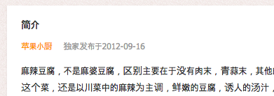
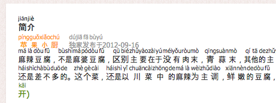
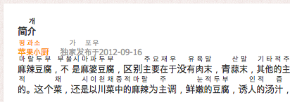

# HanTool
HanTool for web

make ruby tags for han character in the page.

## Usage
### Before

### After - Pinyin

### After - Korean


## Generate DB
HanTool use [unihan](http://www.unicode.org/reports/tr38/#Unihan.zip) provided by unicode association.  
unihan can be download from this url : ftp://ftp.unicode.org/Public/UNIDATA/Unihan.zip
extract *Unihan_Readings.txt* from *unihan.zip*
and run this script to generate db.
```shell
npm run trans Unihan_Readings.txt res/db.json
```

## Build
```shell
npm run build
```

### For Debugging
```shell
npm run debug
```
or you can manually copy sources into *out* directory.  
if not, webbrowser can't find mapped source.
